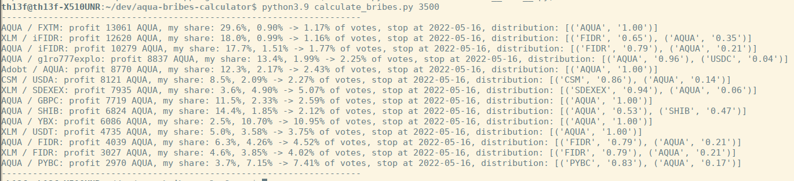

## Aqua bribes calculator
calculate potential bribes profit based on desired amount of aqua to vote

## Prerequisites
python3 (tested on python3.6-python3.9)

## Usage
`python3.9 calculate_bribes.py N`, where N - amount of aqua to vote in thousands